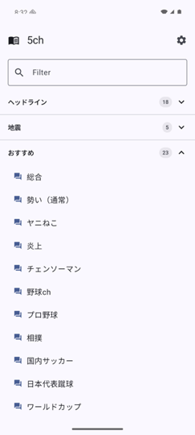
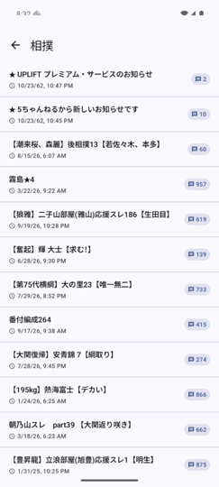
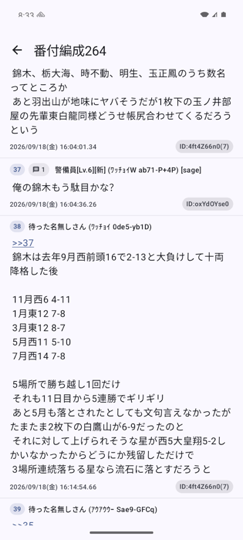
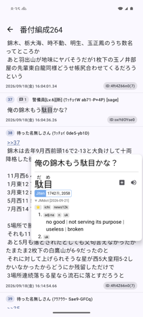
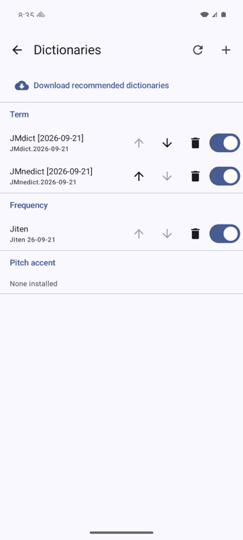
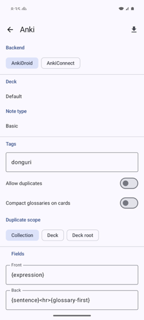

<div align="center">

# Donguri for Android


**Donguri** (どんぐり — "acorn") is a 5ちゃんねる reader with a Yomitan-style
pop-up dictionary and Anki integration, made for reading 5ch as immersion
practice.

An Android port of [Donguri for iOS](https://github.com/iWumboUWumbo2/Donguri),
built the way [Hoshi Reader](https://github.com/Manhhao/Hoshi-Reader) was ported
to [Hoshi Reader Android](https://github.com/HuangAntimony/Hoshi-Reader-Android):
the dictionary and Anki stack comes across from the Android port, and the reader
is rebuilt natively in Compose.

<p align="center">
    
    
    
    
</p>

</div>

## Features

- **Tap any word in a post** to look it up — Yomitan-style pop-up dictionary
  with **deinflection support** (tapping 食べさせられた finds 食べる)
- Support for **all** Yomitan term, frequency and pitch dictionaries
- One-tap **Anki mining** via AnkiDroid or AnkiConnect, with the core handlebars
  used by [Lapis](https://github.com/donkuri/lapis)
- Audio for Yomitan online audio sources
- Standalone dictionary search
- Full 5ch browsing: board menu → boards → threads, with `dat` and `read.cgi`
  archive support (so dat落ち threads still open)
- Reply previews, read-position tracking and per-thread unread counts
- Tap an ID or tripcode to highlight every post by that poster
- Inline image thumbnails with a pinch-zoom fullscreen viewer
- Filter the board list by name
- **NG filtering** (あぼーん) on word, ID or name/tripcode — hidden posts leave a
  placeholder so `>>N` numbering stays correct
- Long-press a post to copy or translate it, or to filter or report it
- Available in Japanese and English

## Getting started

Donguri ships with no dictionaries. On first run, open **⚙︎ → Dictionaries →
Download recommended dictionaries** to fetch JMdict, JMnedict and the Jiten
frequency list (~33 MB), or use **+** to import any Yomitan dictionary `.zip`.

<p align="center">
    
    
</p>

For Anki, open **⚙︎ → Anki**. AnkiDroid is driven through its ContentProvider
API and needs the app installed and its database permission granted; Donguri
asks for that permission the first time it fetches your decks. AnkiConnect works
over HTTP.

Pick a deck and note type, then map each field to the handlebars you want —
Lapis, Kiku and Senren note types are filled in automatically.

## Building

Requires JDK 17+ and the Android SDK. The NDK and CMake are downloaded
automatically on the first build.

```bash
git clone --recurse-submodules <this repo>
./gradlew :app:assembleDebug
```

`third_party/hoshidicts-kotlin-bridge` is a submodule and carries the dictionary
engine — the build will not configure without it.

`reference/Hoshi-Reader-Android` is reading material rather than a build input, and
is skipped by default. To check it out as well:

```bash
git submodule update --init reference/Hoshi-Reader-Android
```

## Releases

Tagging `vMAJOR.MINOR.PATCH` builds a release APK and attaches it to a draft
GitHub release for a human to publish. `versionName` comes from the tag and
`versionCode` is derived from it (`1.2.3` → `10203`).

Signing is optional — without it the workflow still publishes, but the asset is
named `-unsigned` and the release notes say so. To sign, set four repository
secrets:

| Secret | Contents |
| --- | --- |
| `ANDROID_KEYSTORE_BASE64` | `base64 -i release.jks` |
| `ANDROID_KEYSTORE_PASSWORD` | keystore password |
| `ANDROID_KEY_ALIAS` | key alias |
| `ANDROID_KEY_PASSWORD` | key password |

The same four are read from the environment for local release builds, so
`ANDROID_KEYSTORE_FILE=… ./gradlew :app:assembleRelease` signs too. Setting some
but not all of them fails the build rather than quietly producing an unsigned
APK.

Release APKs are arm64-v8a only, matching the `release` build type's ABI filter.

## Credits

Donguri's dictionary and Anki functionality is **ported from
[Hoshi Reader](https://github.com/Manhhao/Hoshi-Reader)** by
[Manhhao](https://github.com/Manhhao) and its Android port
[Hoshi Reader Android](https://github.com/HuangAntimony/Hoshi-Reader-Android) by
[HuangAntimony](https://github.com/HuangAntimony), both GPL-3.0-or-later. Ported
files retain their original copyright and SPDX headers.

| Donguri for Android | Origin |
| --- | --- |
| `assets/donguri-web/popup/*`, `shared/*` | Hoshi Reader Android `assets/hoshi-web/` (verbatim) |
| `popup/PopupHtml.kt`, `PopupEntryJson.kt`, `PopupLayout.kt`, `PopupResourceHandler.kt` | Hoshi Reader Android `features/dictionary/LookupPopup*.kt` |
| `dictionary/*` | Hoshi Reader Android `dictionary/` |
| `de/manhhao/hoshi/HoshiDicts.kt` | `third_party/hoshidicts-kotlin-bridge` (verbatim — must match it exactly) |
| `features/anki/*` | Hoshi Reader Android `features/anki/` |
| `features/dictionary/*` | Hoshi Reader Android `features/dictionary/` |
| `lookup/TextScanner.kt` | Hoshi Reader `selection.js` (scanning logic, ported to Kotlin) |
| `config/UserConfig.kt` | Hoshi Reader `UserConfig.swift`, via Donguri for iOS |

The 5ch reader (`bbs/`) is ported from **Donguri for iOS**, which is the source
of truth for its user-visible behaviour.

The dictionary engine is [hoshidicts](https://github.com/Manhhao/hoshidicts) by
Manhhao, consumed through
[hoshidicts-kotlin-bridge](https://github.com/HuangAntimony/hoshidicts-kotlin-bridge).

Not ported (EPUB-specific, and absent from Donguri on iOS too): the reader
itself, pagination and vertical writing, fonts, highlights, statistics,
ッツ Reader / Google Drive sync, and Sasayaki.

**New to the Android port:** post text renders as native Compose text rather
than in a WebView. iOS needs the WebView because SwiftUI's `Text` cannot
hit-test individual characters; Compose can, so only selection.js's scanning
rules had to come across (`lookup/TextScanner.kt`).

## Licence

GPL-3.0-or-later — see [LICENSE](LICENSE). Donguri is a derivative work of Hoshi
Reader and is distributed under the same licence.
